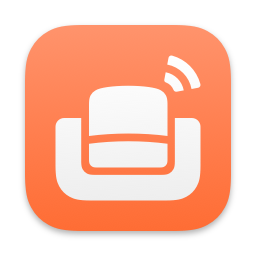

<h1>

Den for RSS
</h1>

Create landscape views of what's happening with a modern, no-nonsense, news aggregator.

Den is designed for those who value simplicity and functionality in a news app. With an intuitive, native interface and broadsheet layouts, Den stands apart by showcasing more content—especially on larger screens—making it easy to stay on top of the news that matters to you. Effortlessly discover interesting articles, compare sources, and spot trends all in one place.

## Key Features

**+ Cloud Sync**\
Seamlessly access your feeds, history, and settings across all your devices—no extra account required.

**+ Wide Format Support**\
Den supports RSS, Atom, and JSON feeds, ensuring compatibility with most sources.

**+ Import & Export**\
Easily back up and restore your feeds using standard OPML files.

**+ Reader Mode**\
Eliminate distractions with clutter-free article views for a streamlined reading experience.

**+ Trending Topics**\
Discover trending news and subjects, surfaced through powerful natural language processing.

**+ Bookmarks**\
Save articles to read later and never lose track of what caught your eye.

**+ Search Functionality**\
Stay up to date by searching for the latest news on specific topics or keywords.

**+ Feed Organizer**\
Manage your feed settings in bulk with ease.

**+ Blocklists**\
Enjoy an ad-free experience by blocking ads and other unwanted content.

**+ Web Extension**\
Automatically discover feeds as you browse the web.

**+ Widgets**\
Stay updated right from your home screen by displaying the latest news from your inbox, a folder, or a specific feed.

---

Copyright &copy; 2020-2024 Garrett Johnson. All rights reserved.
