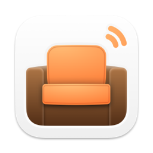

<h1>Den for RSS</h1>

Create custom landscape views of what's happening with a fast and modern news aggregator.

Den is made for people who want a less-is-more browsing experience. What sets it apart from other RSS apps is broadsheet layouts that show more content, especially on larger screens. Having everything plainly laid out makes finding interesting articles, comparing sources, and noticing trends refreshingly simple.

---

Copyright &copy; 2020-2024 Garrett Johnson
