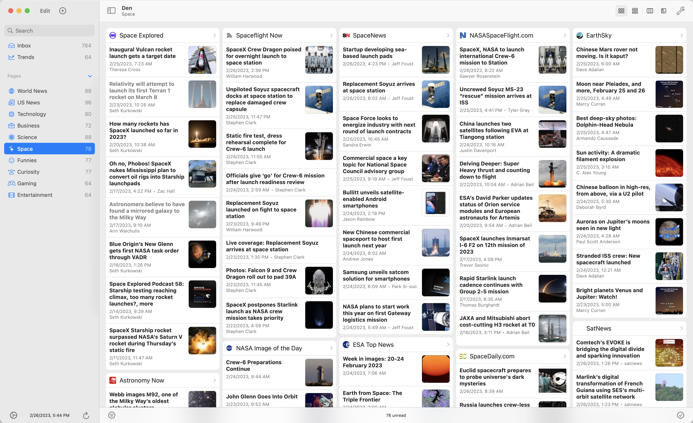

<h1> Den for RSS</h1>

A news app made for clear and intuitive browsing.

- Flexible organization for your collection
- Broadsheet layouts designed to make the most of screen space
- For phones, tablets, laptops, and desktops
- Cloud synchronized profiles
- RSS, Atom, and JSON Feed format support
- OPML import and export
- Feed Detector browser extension
- and much more...

## Installation

Buy [Den for RSS on the App Store](https://apps.apple.com/us/app/den-for-rss/id1528917651) to get both iOS and Mac versions with automatic updates. Purchasing on the App Store supports development. Thank you.

This project does not currently offer a free binary download. Of course, it's possible to compile and install yourslf for free.

## Mission

Den aims to be a news app so sharp it cuts through misinformation like a hot knife through butter.
Given modern devices and networks, there's no reason to compromise on privacy or control.
Anyone can follow hundreds of publishers with all the conveniences provided by 
cloud storage, machine learning, natural language processing, artificial intelligence, etc.
Without added layers of curation, censorship or monetization.

## Design

The icon is a chair because it symbolizes how simple and utilitarian the app aspires to be.
Just a streamlined basic comfort with reliable mechanisms.

## Publishers

Fairness to publishers is a core part of Den.
No one is favored over another except by way of the user preference.
The app doesn't supplement feed content by reading webpages or fetching data from other sources.
What is in a feed is what is available to the user.
It sanitizes HTML for security and compatibility.
But in general, the sky is the limit.
Information rich feeds gather happy followers.
Happy followers are more likely to convert on goals.
The app does its best to let good content speak for itself.

## Open Source

News apps are the platforms world views are built on. 
Folks should be able to trust their choice without hesitation.
They should also have the freedom to make it better.
Furthermore, they should have a voice in the development of software they may come to depend on.
Thus, Den is open source software for trust, transparency, and community.

[♫ Buy it, use it, break it, fix it, trash it, change it, mail, upgrade it.](https://youtu.be/D8K90hX4PrE)
[♫ Work it, make it, do it, makes us, harder, better, faster, stronger.](https://youtu.be/gAjR4_CbPpQ)
    
## Connect

* [Follow the RSS feed](https://den.io/feed.rss) to keep up with news and announcements.
* [Start a discussion on GitHub](https://github.com/garrettrayj/den/discussions/new) to share an idea or ask a question.
* [Create an issue on GitHub](https://github.com/garrettrayj/den/issues/new) to report a bug or request an enhancement.
* [Join the Discord server](https://discord.gg/NS9hMrYrnt) to chat.
* [Email the developer](mailto:garrett@devsci.net) anytime for anything.

## Development

### Prerequisites

1. Xcode with Command Line Tools
2. [xcparse](https://github.com/ChargePoint/xcparse) to extract screenshots from test results. `brew install chargepoint/xcparse/xcparse`
3. [swiftlint](https://github.com/realm/SwiftLint) to check code formatting. `brew install swiftlint`

### Getting Started

1. Clone the project from GitHub
2. Open in Xcode
3. Update development team settings
4. Select the "Den" scheme and device
5. Run the scheme

See the [Contributing Guide](CONTRIBUTING.md) for more.

---

&copy; 2023 Garrett Johnson
